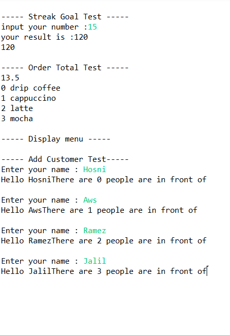

# Java Cafe Assignment

## Overview

This project implements the `CafeUtil` library for the Cafe Java application. The assignment focuses on practicing Java fundamentals such as loops, arrays, ArrayLists, methods, and user input.

The project consists of two files:

* `CafeUtil.java` – Contains all required methods.
* `TestCafe.java` – Contains the `main()` method used to test the functionality.

---

## 🚀 Features

### 1. getStreakGoal()

Calculates the total number of purchases required after 10 weeks by summing consecutive integers from 1 to 10.

#### Example

Input:

```java
appTest.getStreakGoal();
```

Output:

```text
55
```

---

### 2. getOrderTotal(double[] prices)

Calculates the total cost of all items in an order.

#### Example

Input:

```java
double[] prices = {3.5, 1.5, 4.0, 4.5};
```

Output:

```text
13.5
```

---

### 3. displayMenu(ArrayList<String> menuItems)

Displays all menu items along with their index.

#### Example

Input:

```java
["drip coffee", "cappuccino", "latte", "mocha"]
```

Output:

```text
0 drip coffee
1 cappuccino
2 latte
3 mocha
```

---

### 4. addCustomer(ArrayList<String> customers)

Prompts the user to enter their name, greets them, displays how many customers are ahead of them in line, adds them to the customer list, and prints the updated list.

#### Example

Output:

```text
Enter your name please
Hosni
Hello, Hosni!
There are 2 people in front of you
[Ahmad, Ali, Hosni]
```

---

## 🛠️ Technologies Used

* Java
* Eclipse IDE
* Java Collections Framework (ArrayList)

---

## Learning Objectives

Through this assignment, the following concepts were practiced:

* Creating and calling methods
* Working with arrays
* Using ArrayLists
* Looping with `for` loops
* User input handling
* Object instantiation
* Basic testing and debugging

---

## Running the Project

1. Open the project in Eclipse.
2. Compile `CafeUtil.java`.
3. Run `TestCafe.java`.
4. Uncomment the desired test cases one at a time.
5. Verify the output for each method.

---
## 📸 Screenshots

### Results



---
## 👨‍💻 Author

**Hosni Ahmad**

GitHub: `Hosni2005`