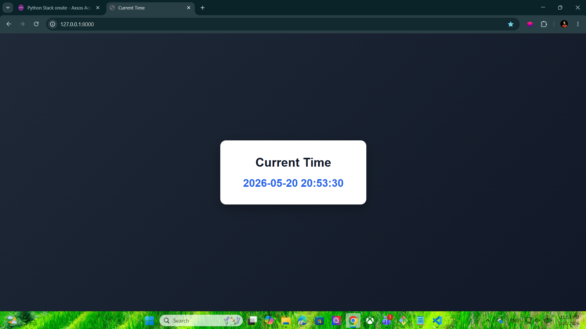

# Django Time Display

A simple Django project that displays the current date and time using Python and Django templates.

## Features

* Display current UTC time
* Django template rendering
* External CSS styling
* Responsive centered layout

---

# Technologies Used

* Python
* Django
* HTML5
* CSS3

---

# Project Structure

```text
project1/
│
├── app1/
│   ├── static/
│   │   └── style.css
│   │
│   ├── templates/
│   │   └── index.html
│   │
│   ├── views.py
│   ├── urls.py
│   └── models.py
│
├── project1/
│   ├── settings.py
│   └── urls.py
│
├── manage.py
└── db.sqlite3
```

---

# Installation

## Clone the repository

```bash
git clone <your-repository-url>
```

## Navigate to the project

```bash
cd project1
```

## Create virtual environment

```bash
python -m venv djangoEnv
```

## Activate virtual environment

### Git Bash

```bash
source djangoEnv/Scripts/activate
```

### CMD

```bash
djangoEnv\Scripts\activate
```

---

# Install Django

```bash
pip install django
```

---

# Run the Server

```bash
python manage.py runserver
```

Open in browser:

```text
http://127.0.0.1:8000/
```

---

# views.py

```python
from django.shortcuts import render
from time import gmtime, strftime


def index(request):

    context = {
        "time": strftime("%Y-%m-%d %H:%M:%S", gmtime())
    }

    return render(request, 'index.html', context)
```

---

# index.html

```html


<!DOCTYPE html>
<html>
<head>
    <title>Time Display</title>
    <link rel="stylesheet" href="">
</head>
<body>

    <div class="container">
        <h1>Current Time</h1>
        <p>{{ time }}</p>
    </div>

</body>
</html>
```

---

# style.css

```css
* {
    margin: 0;
    padding: 0;
    box-sizing: border-box;
}

body {
    font-family: Arial, sans-serif;
    background: linear-gradient(135deg, #1f2937, #111827);
    height: 100vh;
    display: flex;
    justify-content: center;
    align-items: center;
}

.container {
    background-color: white;
    padding: 40px 60px;
    border-radius: 15px;
    text-align: center;
    box-shadow: 0 10px 30px rgba(0, 0, 0, .3);
}

h1 {
    margin-bottom: 20px;
    color: #111827;
}

p {
    font-size: 28px;
    font-weight: bold;
    color: #2563eb;
}
```

---

# Output

The application displays the current UTC time inside a styled card layout.

---
# Screenshot



# Author

Hosni Ahmad
