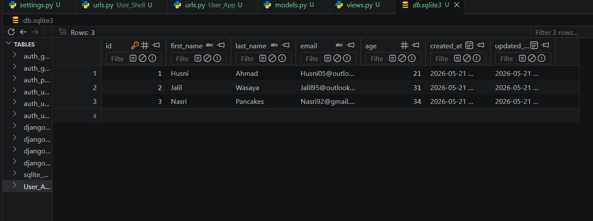
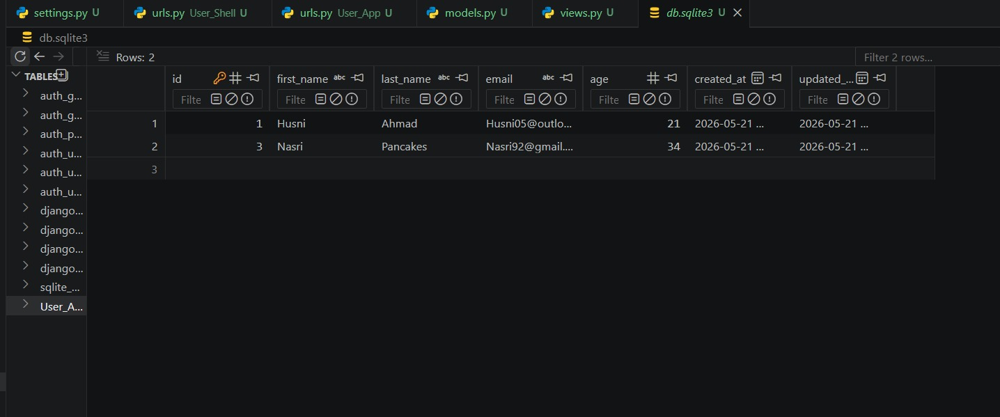
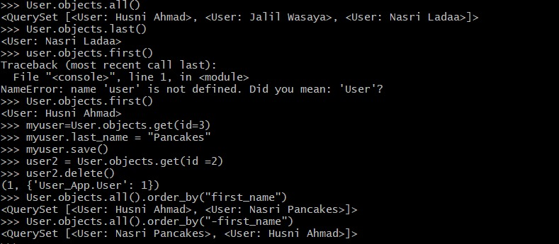

# Users (Shell) – Django ORM Assignment

## Project Overview
This project demonstrates how to use the Django Shell and ORM commands to create, retrieve, update, delete, and sort data in a database.

The project contains:
- Django Project: `User_Shell`
- Django App: `User_app`
- Model: `User`

---

# Features
- Create users using Django Shell
- Retrieve all users
- Retrieve first and last user
- Update user data
- Delete users
- Sort users ascending and descending
- View data inside SQLite database

---

# Technologies Used
- Python
- Django
- SQLite3

---

# User Model

```python
from django.db import models

class User(models.Model):
    first_name = models.CharField(max_length=255)
    last_name = models.CharField(max_length=255)
    email = models.EmailField()
    age = models.IntegerField()
    created_at = models.DateTimeField(auto_now_add=True)
    updated_at = models.DateTimeField(auto_now=True)

    def __str__(self):
        return f"{self.first_name} {self.last_name}"
```

---

# Migration Commands

```bash
python manage.py makemigrations
python manage.py migrate
```

---

# Run Django Shell

```bash
python manage.py shell
```

Import the model:

```python
from users_app.models import User
```

---

# ORM Queries

## Create 3 Users

```python
User.objects.create(first_name="Husni", last_name="Ahmad", email="Husni05@outlook.com", age=21)

User.objects.create(first_name="Jalil", last_name="Wasaya", email="Jalil95@outlook.com", age=31)

User.objects.create(first_name="Nasri", last_name="Ladaa", email="Nasri92@gmail.com", age=34)
```

---

## Retrieve All Users

```python
User.objects.all()
```

---

## Retrieve Last User

```python
User.objects.last()
```

---

## Retrieve First User

```python
User.objects.first()
```

---

## Update User with id=3

```python
myuser = User.objects.get(id=3)

myuser.last_name = "Pancakes"

myuser.save()
```

---

## Delete User with id=2

```python
user2 = User.objects.get(id=2)

user2.delete()
```

---

## Sort Users by First Name

### Ascending Order

```python
User.objects.all().order_by("first_name")
```

### Descending Order

```python
User.objects.all().order_by("-first_name")
```

---

# Screenshots

## Creating Users


---

## SQLite Database Before Update/Delete



---

## SQLite Database After Update/Delete



---

## Shell Queries Output



---

# Project Structure

```bash
single_model_orm/
│
├── users_app/
│   ├── models.py
│   ├── views.py
│   ├── urls.py
│
├── static/
│   ├── create.png
│   ├── sql-lite.png
│   ├── sql-lite2.png
│   └── show.png
│
├── db.sqlite3
├── manage.py
└── README.md
```

---

# Notes
- `objects.create()` creates and saves data directly.
- `objects.get()` retrieves one object using a condition.
- `save()` updates the object in the database.
- `delete()` removes the object from the database.
- `order_by()` sorts query results.

---

# Author

Hosni Ahmad