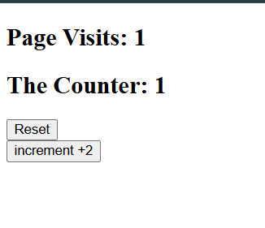
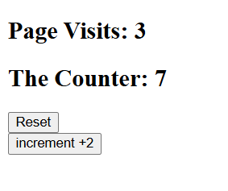
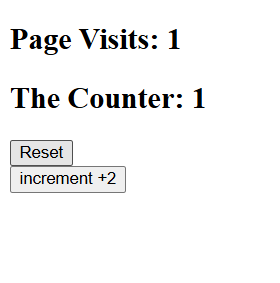

# Django Session Counter

A simple Django project that tracks how many times a user visits the website using Django sessions.

## Features

- Count page visits using sessions
- Increment counter manually by +2
- Reset the session and counter
- Simple and clean user interface
- Beginner-friendly Django project

---

## Technologies Used

- Python
- Django
- HTML5
- CSS3

---

## Project Structure

```bash
app1/
│── admin.py
│── apps.py
│── models.py
│── tests.py
│── urls.py
│── views.py
│
templates/
│── index.html
│
static/
│── style.css
```

---

## URL Routes

| Route | Description |
|---|---|
| `/` | Main page that displays visits and counter |
| `/increment/` | Adds +2 to the counter |
| `/destroy/` | Clears the session and resets everything |

---

## How It Works

### Session Logic

The application uses Django sessions to store:

- `visits` → counts page refreshes
- `counter` → stores the custom counter value

When the user visits the page:

```python
request.session['visits'] += 1
request.session['counter'] += 1
```

When clicking the increment button:

```python
request.session['counter'] += 2
```

When clicking reset:

```python
request.session.flush()
```

---

## Views

### index()

- Checks if session values exist
- Creates them if they do not exist
- Increments the counters
- Renders the main page

### increment()

- Adds +2 to the counter
- Redirects back to the homepage

### destroy()

- Clears all session data
- Redirects back to the homepage

---

## HTML Template

The template displays:

- Number of page visits
- Current counter value
- Reset button
- Increment button

Example:

```html
<h2>Page Visits: {{ request.session.visits }}</h2>
<h2>The Counter: {{ request.session.counter }}</h2>
```

---

## Installation

### 1. Clone the repository

```bash
git clone <your-repository-link>
```

### 2. Navigate into the project

```bash
cd your-project-name
```

### 3. Install Django

```bash
pip install django
```

### 4. Run migrations

```bash
python manage.py migrate
```

### 5. Start the server

```bash
python manage.py runserver
```

### 6. Open in browser

```bash
http://127.0.0.1:8000
```

---

## Screenshots

Add your screenshots here:







---

## Learning Goals

This project helps practice:

- Django sessions
- URL routing
- Views and redirects
- HTML templates
- Session management
- Django project structure

---

## Author

Hosni Ahmad

GitHub: [Hosni2005](https://github.com/Hosni2005)
