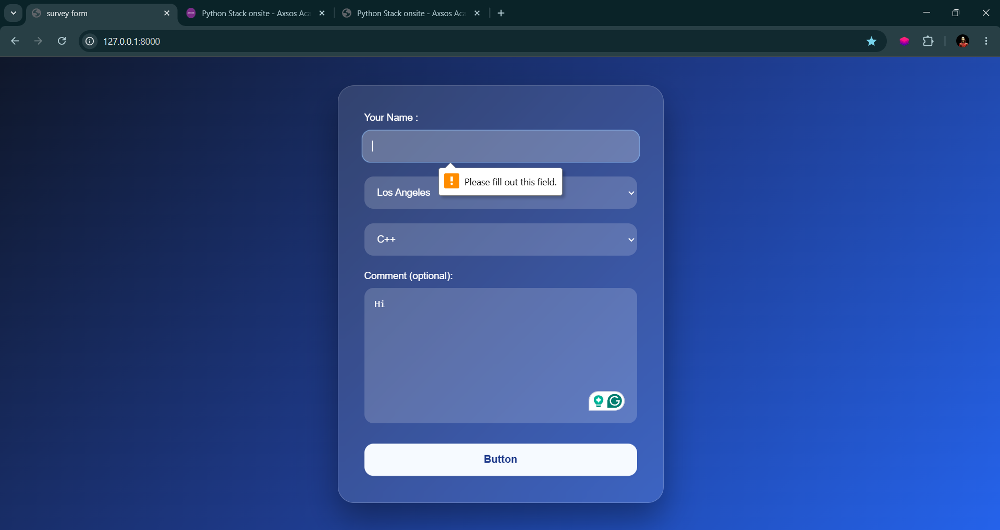
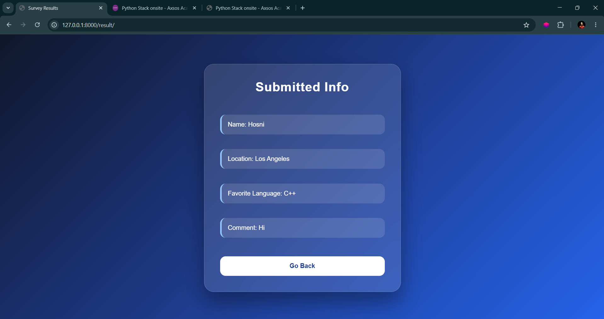

# Django Survey Form

A modern Django Survey Form project that allows users to submit their personal information, choose a location, select their favorite programming language, and leave an optional comment.

The project includes a clean glassmorphism UI design with responsive styling.

---

## 🚀 Features

- Submit user survey information
- Django form handling using POST requests
- Redirect functionality
- Input validation for required fields
- Responsive modern UI
- Glassmorphism design
- Separate result page displaying submitted data

---

## 🛠️ Technologies Used

- Python
- Django
- HTML5
- CSS3

---

## 📂 Project Structure

```bash
project/
│
├── app1/
│   ├── static/
│   │   └── style.css
│   │
│   ├── templates/
│   │   ├── index.html
│   │   └── result.html
│   │
│   ├── views.py
│   ├── urls.py
│   ├── models.py
│   └── apps.py
│
├── manage.py
└── db.sqlite3
```

---

## 📸 Screenshots

### Home Page

```md

```

### Survey Result Page

```md

```

Create an `images` folder inside your repository and place your screenshots there.

---

## ⚙️ Installation & Setup

Clone the repository:

```bash
git clone https://github.com/Hosni2005
```

Move into the project folder:

```bash
cd your-repository-name
```

Install Django:

```bash
pip install django
```

Run the server:

```bash
python manage.py runserver
```

Open in browser:

```bash
http://127.0.0.1:8000/
```

---

## 👨‍💻 Author

**Hosni Ahmad**

GitHub: `Hosni2005`
