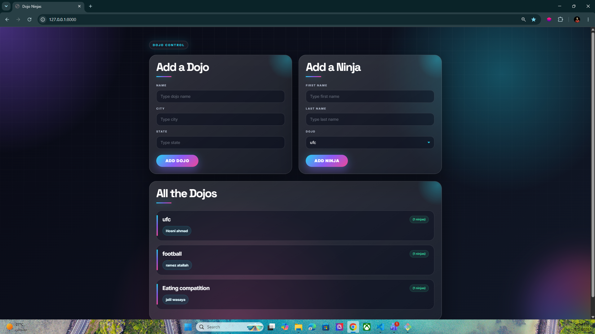

# 🥷 Dojo & Ninja Manager

A stylish Django project for managing **Dojos** and their **Ninjas** with a modern UI and responsive design.

---

## 🚀 Features

- Add new Dojos
- Add Ninjas to specific Dojos
- Display all Dojos and their Ninjas
- Responsive modern UI
- Custom premium CSS design
- Django Models & ORM relationships
- Form handling with POST requests
- Dynamic template rendering using Django Templates

---

## 🛠️ Technologies Used

- Python
- Django
- HTML5
- CSS3
- Django ORM
- SQLite3

---

## 📂 Project Structure

```bash
project/
│
├── app1/
│   ├── migrations/
│   ├── static/
│   │   └── style.css
│   ├── templates/
│   │   └── index.html
│   ├── models.py
│   ├── views.py
│   ├── urls.py
│   └── admin.py
│
├── manage.py
└── db.sqlite3
```

---

## 🧠 Models

### Dojo Model

```python
class Dojo(models.Model):
    name = models.CharField(max_length=255)
    city = models.CharField(max_length=255)
    state = models.CharField(max_length=255)
```

### Ninja Model

```python
class Ninja(models.Model):
    first_name = models.CharField(max_length=255)
    last_name = models.CharField(max_length=255)
    dojo = models.ForeignKey(
        Dojo,
        related_name='ninjas',
        on_delete=models.CASCADE
    )
```

---

## ⚡ Installation

Clone the repository:

```bash
git clone <your-repository-link>
```

Move into the project folder:

```bash
cd project-name
```

Install dependencies:

```bash
pip install django
```

Run migrations:

```bash
python manage.py migrate
```

Start the server:

```bash
python manage.py runserver
```

Open in browser:

```bash
http://127.0.0.1:8000
```

---

## 📸 Screenshots

### Main Page





---

## 🎨 UI Design

This project includes a custom modern CSS design with:

- Glassmorphism effects
- Smooth hover animations
- Neon gradients
- Responsive layout
- Premium card design
- Dark futuristic theme

---

## 📌 Future Improvements

- Delete Ninja feature
- Edit Dojo information
- Authentication system
- Search functionality
- Profile pages
- Pagination

---

## 👨‍💻 Author

**Hosni Ahmad**

GitHub: [Hosni2005](https://github.com/Hosni2005)

---

## ⭐ Support

If you like this project, leave a ⭐ on GitHub.
