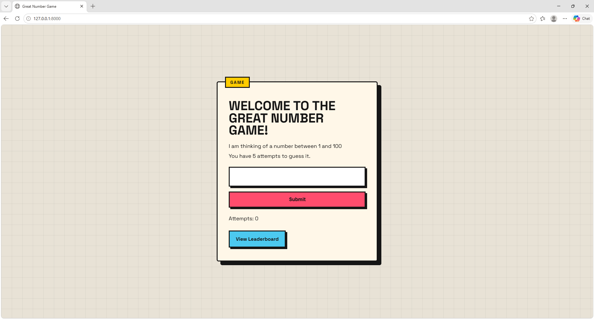
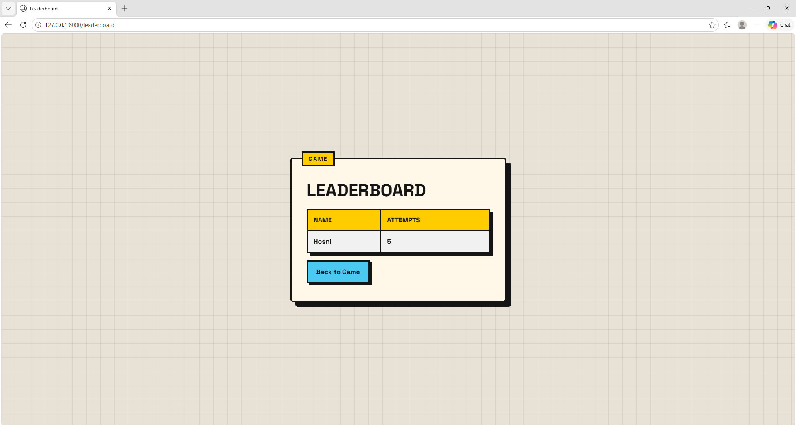

# Great Number Game 🎯

A fun and interactive number guessing game built with the Django framework.  
The player has **5 attempts** to guess a randomly generated number between **1 and 100**.  
The project also includes a **Leaderboard system** that stores winners using Django sessions.

---

## Features 🚀

- Random number generation between 1–100
- Maximum of 5 attempts
- Messages for:
  - Too High
  - Too Low
  - Correct Guess
  - Losing the Game
- Leaderboard system
- Session-based game tracking
- Stylish modern UI using custom CSS
- Responsive design for mobile devices

---

## Technologies Used 🛠️

- Python
- Django
- HTML5
- CSS3
- Django Sessions

---

## Project Structure 📂

```bash
app1/
│
├── templates/
│   ├── index.html
│   └── leaderboard.html
│
├── static/
│   └── style.css
│
├── views.py
├── urls.py
├── models.py
├── admin.py
├── apps.py
└── tests.py
```

---

## URL Routes 🌐

| Route | Description |
|---|---|
| `/` | Main game page |
| `/guess` | Handles user guesses |
| `/save_winner` | Saves winner to leaderboard |
| `/leaderboard` | Displays leaderboard |
| `/reset` | Resets the game |

---

## Game Logic 🎮

The game starts by generating a random number and storing it inside the session.

```python
request.session["number"] = random.randint(1, 100)
```

The application tracks:
- Generated number
- Attempts count
- Status messages
- Leaderboard data

---

## Main Game Page 🕹️

The player enters a number and submits their guess.

Features included:
- Dynamic status messages
- Attempt counter
- Win/Lose states
- Reset functionality
- Leaderboard button

---

## Leaderboard 🏆

The leaderboard stores:
- Winner name
- Number of attempts

Displayed inside a styled table.

---

## Styling 🎨

The project uses a bold modern UI design featuring:
- Custom shadows
- Retro-style borders
- Responsive layout
- Animated buttons
- Dynamic message colors

---

## Installation ⚙️

### 1. Clone the Repository

```bash
git clone <your-repository-url>
```

### 2. Navigate to Project Folder

```bash
cd your-project-folder
```

### 3. Install Django

```bash
pip install django
```

### 4. Run the Server

```bash
python manage.py runserver
```

### 5. Open in Browser

```bash
http://127.0.0.1:8000/
```

---

## Screenshots 📸

Add your screenshots inside a folder called:

```bash
screenshots/
```

Example:






---

## Future Improvements 💡

- Store leaderboard in database instead of sessions
- Add difficulty levels
- Add timer mode
- Add multiplayer support
- Add score ranking system

---

## Author 👨‍💻

**Hosni Ahmad**

GitHub: https://github.com/Hosni2005
