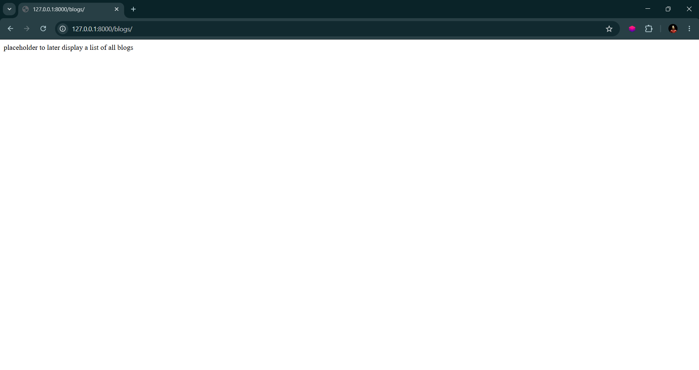
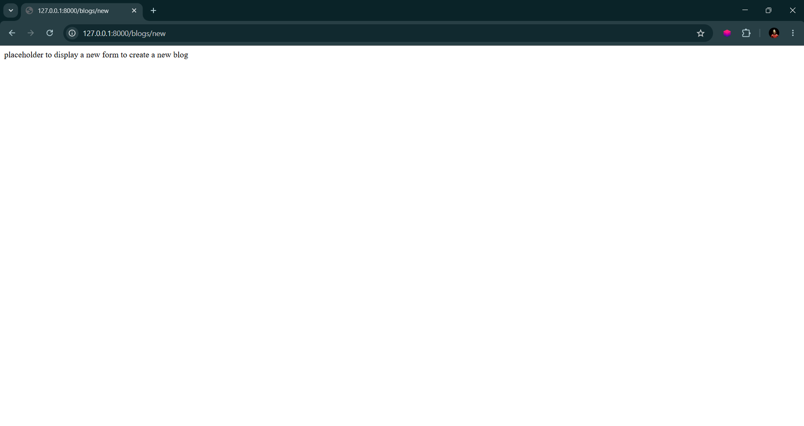
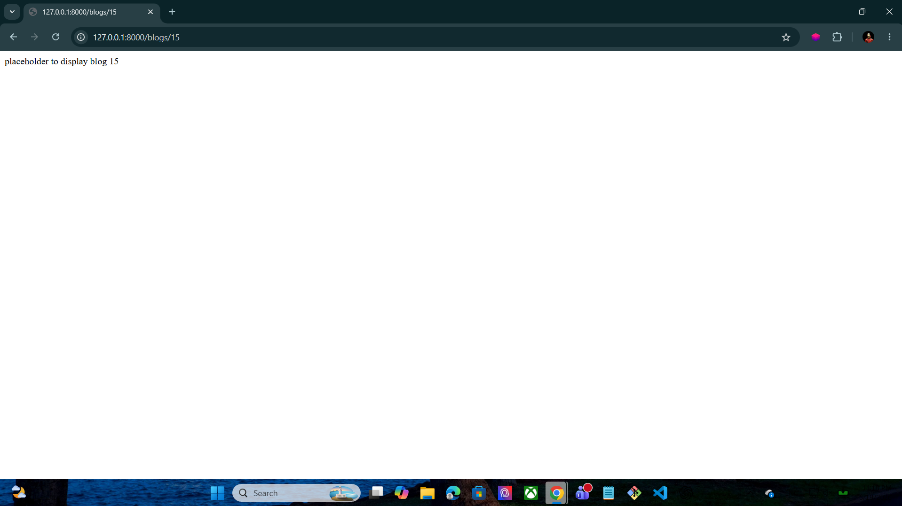
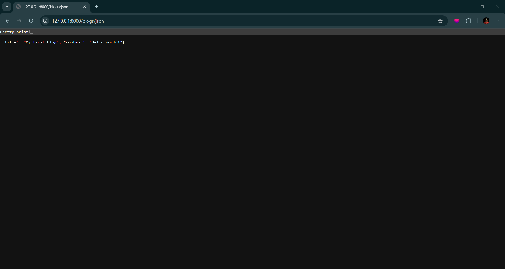

# Django Blogs Project

A simple Django project that demonstrates basic routing, redirects, dynamic URL parameters, JSON responses, and HTTP responses.

---

# Features

* Django URL Routing
* Redirects using `redirect()`
* Dynamic Routes
* JSON Response
* HTTP Responses
* Basic HTML Templates
* Simple Blog Route Structure

---

# Technologies Used

* Python
* Django
* HTML5

---

# Project Structure

```bash
project/
│
├── app1/
│   ├── templates/
│   │   ├── index.html
│   │   └── blogs.html
│   ├── admin.py
│   ├── apps.py
│   ├── models.py
│   ├── tests.py
│   ├── urls.py
│   └── views.py
│
└── manage.py
```

---

# URL Routes

| Route                    | Function  | Description                |
| ------------------------ | --------- | -------------------------- |
| `/`                      | `root`    | Redirects to `/blogs`      |
| `/blogs/`                | `index`   | Displays all blogs         |
| `/blogs/new`             | `new`     | Displays form for new blog |
| `/blogs/create`          | `create`  | Handles blog creation      |
| `/blogs/<number>`        | `show`    | Displays specific blog     |
| `/blogs/<number>/edit`   | `edit`    | Edit a blog                |
| `/blogs/<number>/delete` | `destroy` | Delete a blog              |
| `/blogs/json`            | `json`    | Returns JSON response      |

---

# Redirect Example

The `/blogs/create` route redirects to the root route `/` using Django's `redirect()` method.

## Example

```python
from django.shortcuts import redirect

def create(request):
    return redirect('/')
```

The root route then redirects the user to `/blogs`.

```python
from django.shortcuts import redirect

def root(request):
    return redirect('/blogs')
```

---

# Important Fix For Dynamic Routes

When creating dynamic routes like:

```python
path('blogs/<number>', views.show)
```

Django treats everything after `/blogs/` as a parameter.

Example:

```text
/blogs/json_data
```

Django thinks:

```python
number = "json_data"
```

This causes a `ValueError` when Django tries to convert `json_data` into an integer.

## Correct Solution

Use Django integer converters.

```python
path('blogs/<int:number>', views.show)
```

Also update edit and delete routes:

```python
path('blogs/<int:number>/edit', views.edit)
path('blogs/<int:number>/delete', views.destroy)
```

---

# urls.py

```python
from django.urls import path
from . import views

urlpatterns = [
    path('', views.root),
    path('blogs/', views.index),
    path('blogs/new', views.new),
    path('blogs/create', views.create),
    path('blogs/<number>', views.show),
    path('blogs/<number>/edit', views.edit),
    path('blogs/<number>/delete', views.destroy),
    path('blogs/json', views.json),
]
```

---

# views.py

```python
from django.shortcuts import render, redirect
from django.http import JsonResponse , HttpResponse


def root(request):
    return redirect('/blogs')


def index(request):
    return HttpResponse("placeholder to later display a list of all blogs")


def new(request):
    return HttpResponse("placeholder to display a new form to create a new blog")


def create(request):
    return redirect('/')


def show(request, number):
    return HttpResponse(f"placeholder to display blog {number}")


def edit(request, number):
    return HttpResponse(f"placeholder to edit blog {number}")


def destroy(request, number):
    return HttpResponse(f"placeholder to delete blog {number}")


def json(request):
    return JsonResponse({
        "title": "My first blog",
        "content": "Hello world!"
    })
```

---

# Templates

## index.html

```html
<!DOCTYPE html>
<html lang="en">
<head>
    <meta charset="UTF-8">
    <meta name="viewport" content="width=device-width, initial-scale=1.0">
    <title>first project</title>
</head>
<body>
    <h1>Hello Hosni</h1>
</body>
</html>
```

## blogs.html

```html
<!DOCTYPE html>
<html lang="en">
<head>
    <meta charset="UTF-8">
    <meta name="viewport" content="width=device-width, initial-scale=1.0">
    <title>test</title>
</head>
<body>
    <h1>test</h1>
</body>
</html>
```

---

# Screenshots

## Home Page



---

## Blogs Page



---

## Numbers Page



---

## JSON Route



---

# How to Run the Project

## 1. Install Django

```bash
pip install django
```

## 2. Run the Server

```bash
python manage.py runserver
```

---

# Open in Browser

```bash
http://127.0.0.1:8000/
```

---

# Author

Hosni Ahmad
