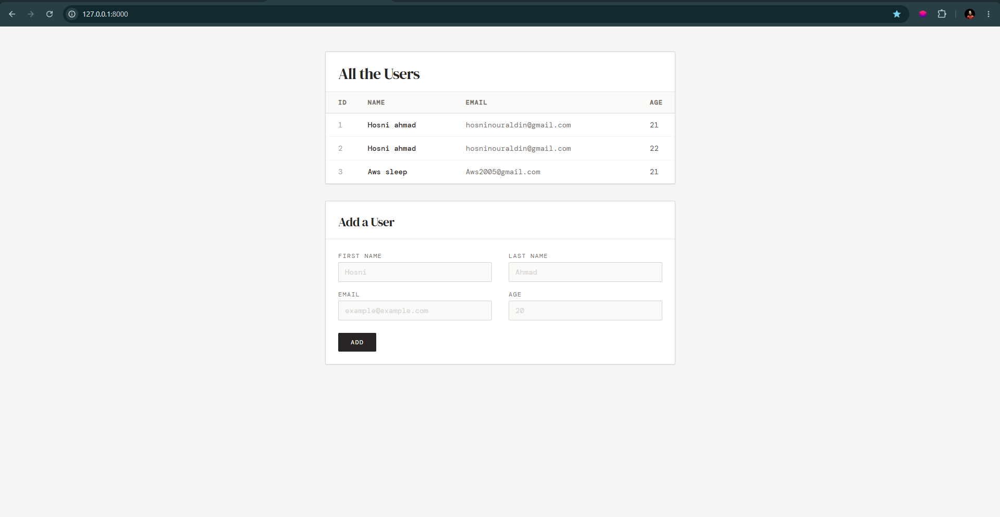
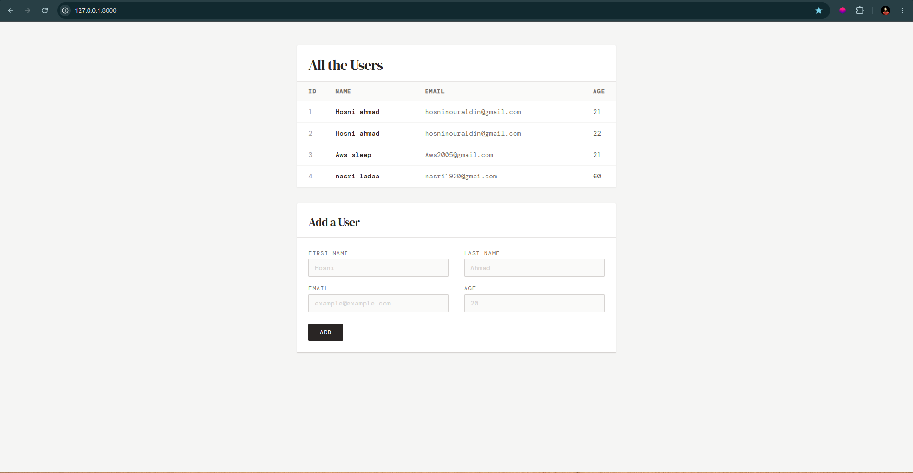

# Users with Templates - Django Project

A simple Django project that displays all users in a styled table and allows adding new users using a form.

---

## Features

- Display all users from the database
- Add new users using a form
- Django ORM integration
- TailwindCSS modern UI
- Responsive design
- Dynamic rendering using Django Templates

---

## Technologies Used

- Python
- Django
- SQLite3
- HTML5
- TailwindCSS

---

# Project Structure

```bash
app1/
│
├── migrations/
│   └── 0001_initial.py
│
├── templates/
│   └── index.html
│
├── admin.py
├── apps.py
├── models.py
├── tests.py
├── urls.py
├── views.py
```

---

# Setup & Installation

## 1. Install Django

```bash
pip install django
```

## 2. Run Migrations

```bash
python manage.py makemigrations
python manage.py migrate
```

## 3. Run Server

```bash
python manage.py runserver
```

---

# URL Routes

| Route | Description |
|------|------|
| `/` | Display all users |
| `/result` | Add a new user |

---

# Model

```python
from django.db import models

class User(models.Model):
    firstname = models.CharField(max_length=100)
    lastname = models.CharField(max_length=100)
    email = models.EmailField(max_length=100)
    age = models.IntegerField()

    def __str__(self):
        return f"{self.firstname} {self.lastname}"
```

---

# Views

```python
from django.shortcuts import render, redirect
from .models import User

def landing(request):
    users = User.objects.all()
    return render(request, 'index.html', {'users': users})

def index(request):

    if request.method == 'POST':
        firstname = request.POST.get('firstname')
        lastname = request.POST.get('lastname')
        email = request.POST.get('email')
        age = request.POST.get('age')

        user = User(
            firstname=firstname,
            lastname=lastname,
            email=email,
            age=age
        )
        user.save()

    return redirect('/')
```

---

# Screenshots

## Home page



## Users Table




---

# UI Preview

- Modern TailwindCSS interface
- Dynamic users table
- Clean form design
- Fully responsive layout

---

# Author

Hosni Ahmad
