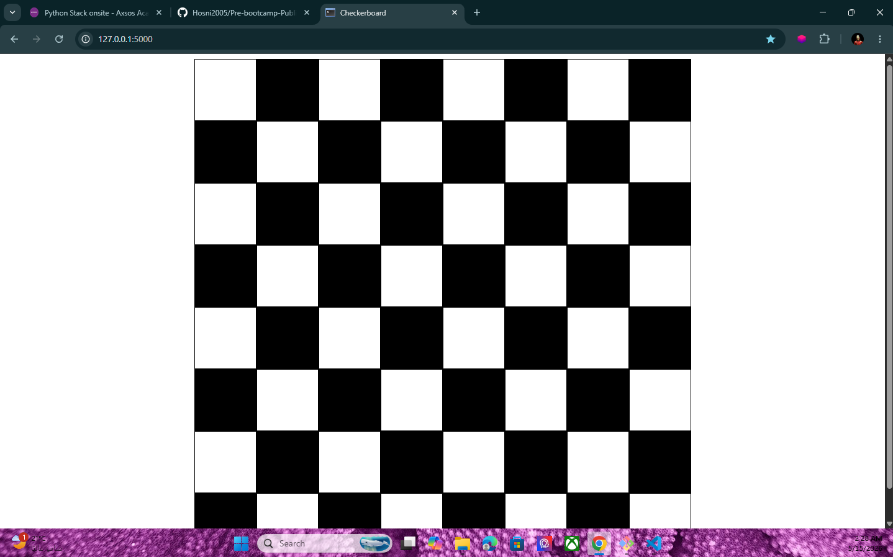
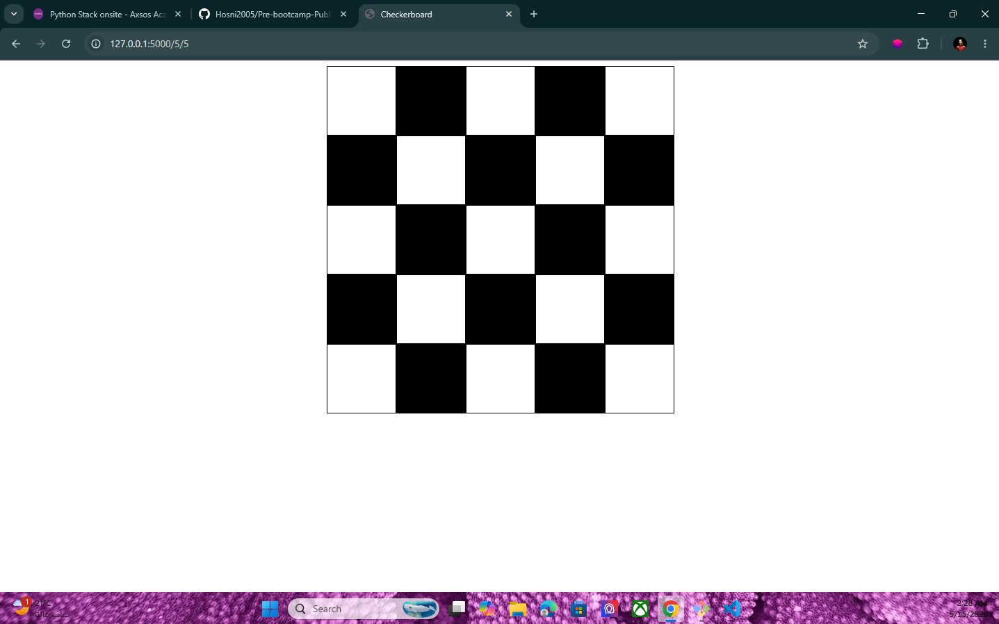
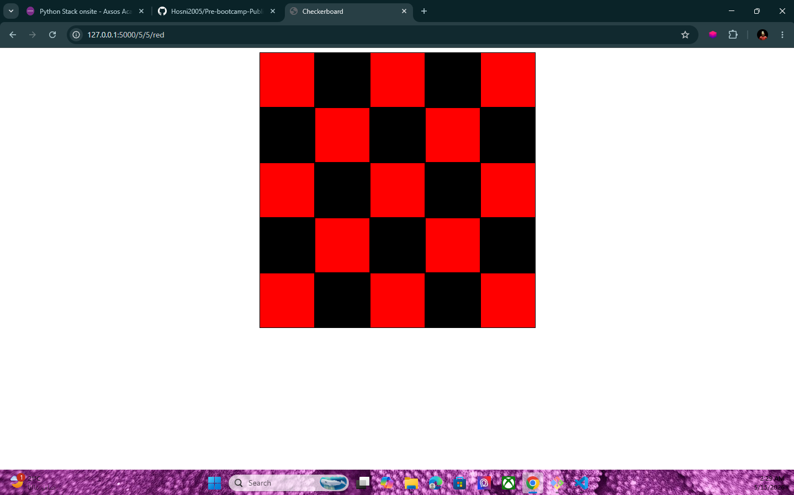
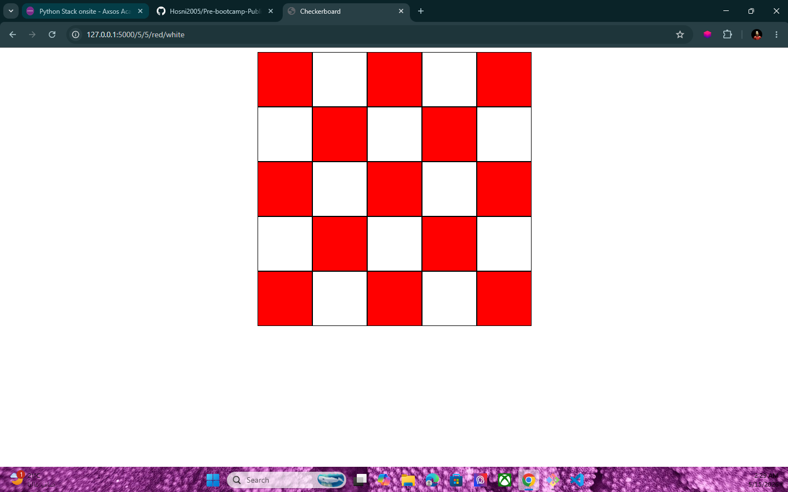

# Checkerboard

A simple Flask project that generates a dynamic checkerboard using Python, Flask, HTML, CSS, and Jinja.

## Project Description

This project displays a checkerboard in the browser.  
The board size and colors can be changed directly from the URL.

## Features

- Default 8x8 checkerboard
- Custom number of columns
- Custom number of rows
- Custom first color
- Custom second color
- Dynamic rendering using Jinja loops
- Clean checkerboard layout using CSS Flexbox

## Technologies Used

- Python
- Flask
- HTML
- CSS
- Jinja

## Project Structure

```text
checkerboard/
│
├── server.py
├── templates/
│   └── index.html
└── static/
    └── style.css
```

## How to Run

1. Install Flask:

```bash
pip install flask
```

2. Run the server:

```bash
python server.py
```

3. Open the project in your browser:

```text
http://127.0.0.1:5000
```

## Routes

| Route | Description |
|---|---|
| `/` | Displays the default 8x8 checkerboard |
| `/<x>` | Displays a checkerboard with `x` columns and 8 rows |
| `/<x>/<y>` | Displays a checkerboard with `x` columns and `y` rows |
| `/<x>/<y>/<color1>` | Displays a checkerboard with a custom first color |
| `/<x>/<y>/<color1>/<color2>` | Displays a checkerboard with two custom colors |

## Examples

```text
http://127.0.0.1:5000/
```

Displays an 8x8 black and white checkerboard.

```text
http://127.0.0.1:5000/5/5
```

Displays a 5x5 checkerboard.

```text
http://127.0.0.1:5000/5/5/red
```

Displays a 5x5 checkerboard using red and black.

```text
http://127.0.0.1:5000/5/5/red/white
```

Displays a 5x5 checkerboard using red and white.

## Code Overview

The Flask server sends the board size and colors to the HTML template.

```python
return render_template("index.html", x=int(x), y=int(y), color1=color1, color2=color2)
```

The template uses a loop to create the squares:

```html

```

The row and column positions decide which color each square should use.

## Screenshots

### Default Checkerboard



### 5x5 Checkerboard



### Custom Red and Black Checkerboard



### Custom Red and White Checkerboard



## Author

Created by Hosni Ahmad.
