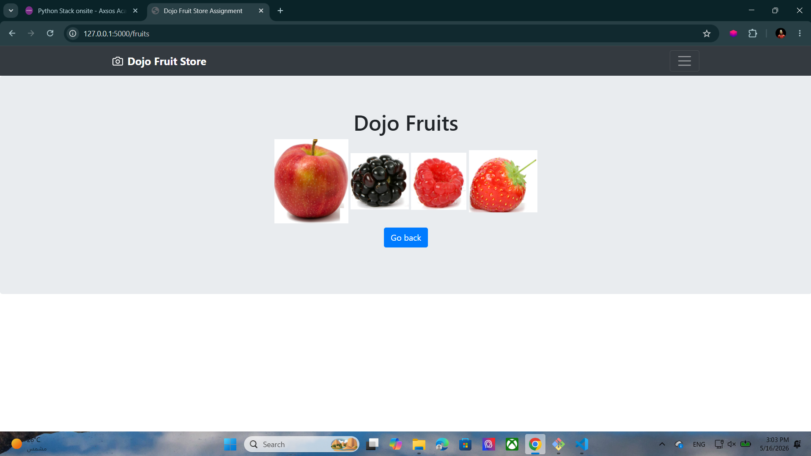
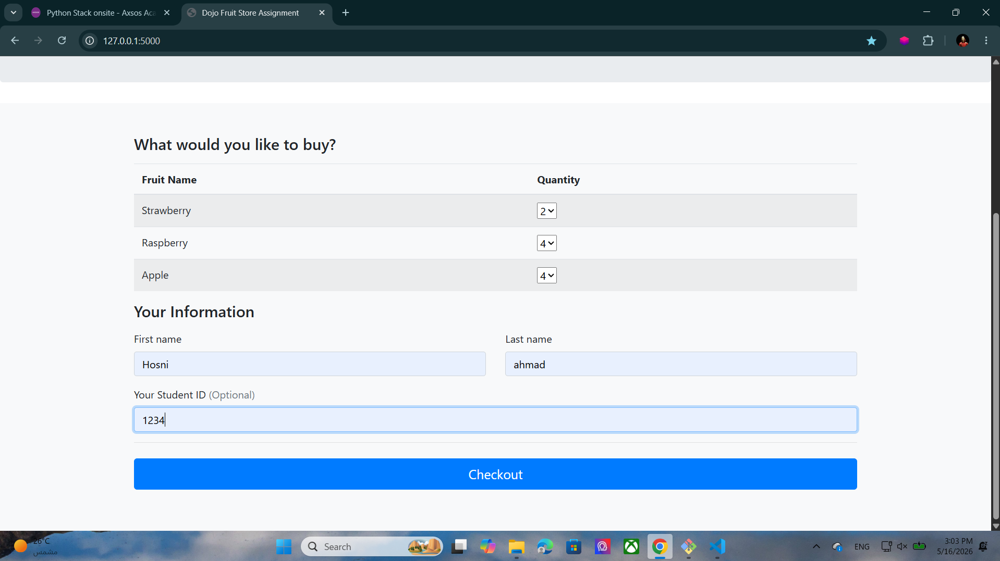
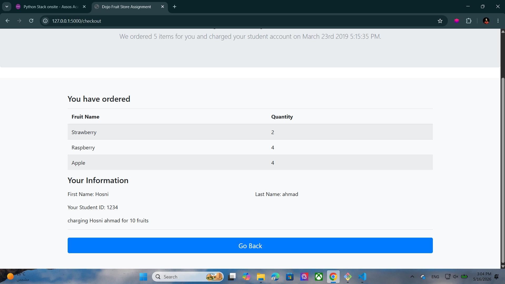
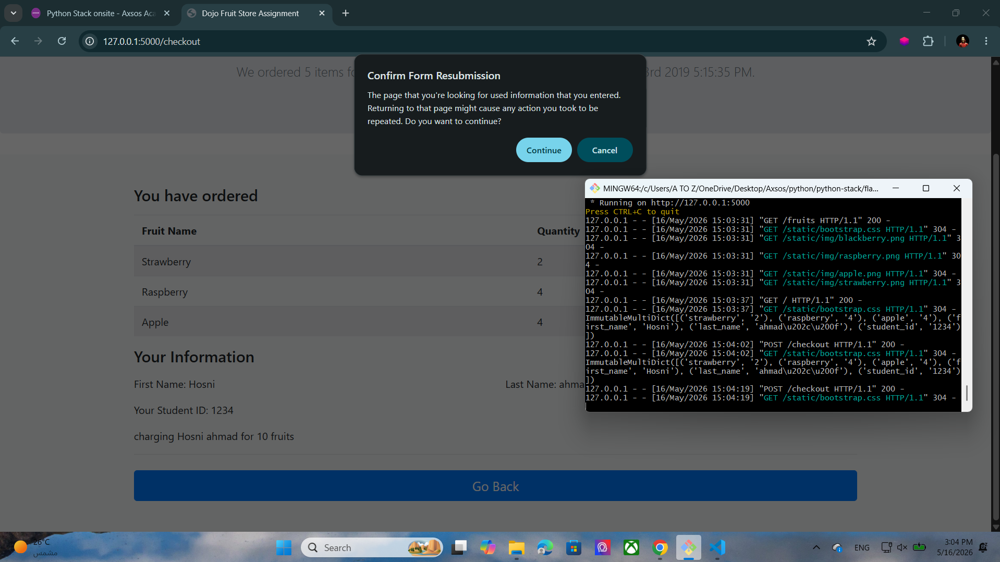

# 🍓 Dojo Fruit Store

A simple Flask web application that allows users to order fruits online and view their checkout summary.  
Built using **Python Flask**, **HTML**, **Bootstrap**, and **Sessions**.

---

## 🚀 Features

- Select fruit quantities
- Submit customer information
- Checkout page with order summary
- Session handling using Flask
- Separate fruits showcase page
- Bootstrap responsive design

---

## 🛠️ Technologies Used

- Python
- Flask
- HTML5
- Bootstrap 4
- Jinja2 Templates

---

## 📂 Project Structure

```bash
dojo-fruit-store/
│
├── static/
│   ├── bootstrap.css
│   ├── bootstrap.min.js
│   └── img/
│       ├── apple.png
│       ├── blackberry.png
│       ├── raspberry.png
│       └── strawberry.png
│
├── templates/
│   ├── index.html
│   ├── checkout.html
│   └── fruits.html
│
├── server.py
└── README.md
```

---

## ▶️ How to Run

1. Clone the repository

```bash
git clone <your-repo-link>
```

2. Navigate to the project folder

```bash
cd dojo-fruit-store
```

3. Install Flask

```bash
pip install flask
```

4. Run the server

```bash
python server.py
```

5. Open in browser

```bash
http://127.0.0.1:5000
```

---

## 📸 Screenshots

### 🍎 Fruits Page



---
### 🏠 Home Page



---


### 🧾 Checkout Result



---

### 🔄 Refresh Warning



---

## 📋 Main Routes

| Route | Description |
|---|---|
| `/` | Main order page |
| `/checkout` | Checkout summary page |
| `/fruits` | Fruits showcase page |

---

## 🧠 Flask Concepts Used

- Flask Routing
- POST Requests
- Sessions
- Jinja Templating
- Form Handling
- Rendering Templates

---

## 👨‍💻 Author

Hosni Ahmad

GitHub: Hosni2005
