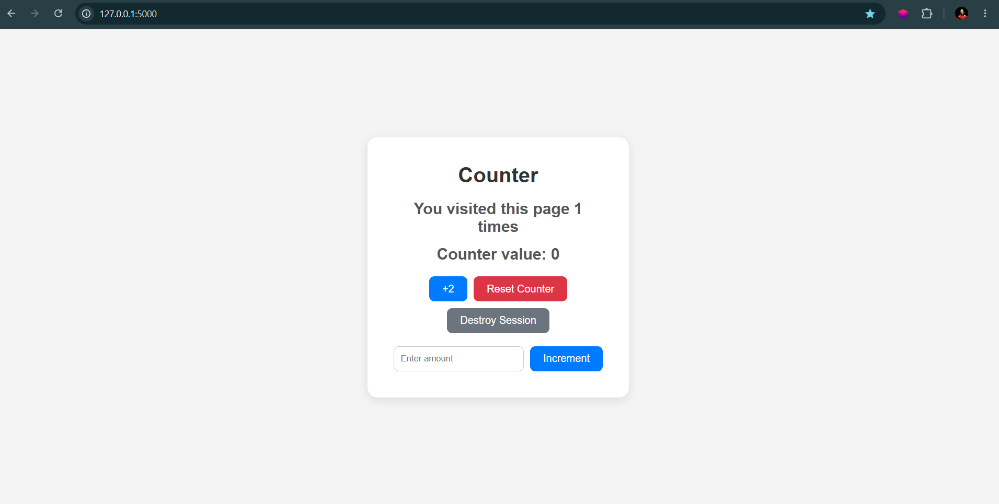

# Counter Application

A simple Flask web application that tracks how many times a user visits the website using Flask sessions.

## Features

- Count page visits using sessions
- Reset session data
- Increment counter by 2
- Custom increment value
- Reset counter button
- Styled user interface with CSS

## Technologies Used

- Python
- Flask
- HTML5
- CSS3

## Project Structure

```bash
counter/
│
├── server.py
├── static/
│   └── style.css
│
└── templates/
    └── index.html
```

## Installation

1. Clone the repository

```bash
git clone <your-repository-url>
```

2. Navigate to the project folder

```bash
cd counter
```

3. Install Flask

```bash
pip install flask
```

4. Run the application

```bash
python server.py
```

5. Open in browser

```bash
http://localhost:5000
```

## Routes

| Route | Description |
|---|---|
| `/` | Displays visit count and counter |
| `/add_two` | Adds 2 to the counter |
| `/increment` | Adds custom value to counter |
| `/reset` | Resets the counter |
| `/destroy_session` | Clears all session data |

## Screenshots

### Counter Page



## Example

- Visit counter increases every refresh
- Counter value can be updated using buttons or custom input
- Session data resets when destroy session button is clicked

## Author

Hosni Ahmad
