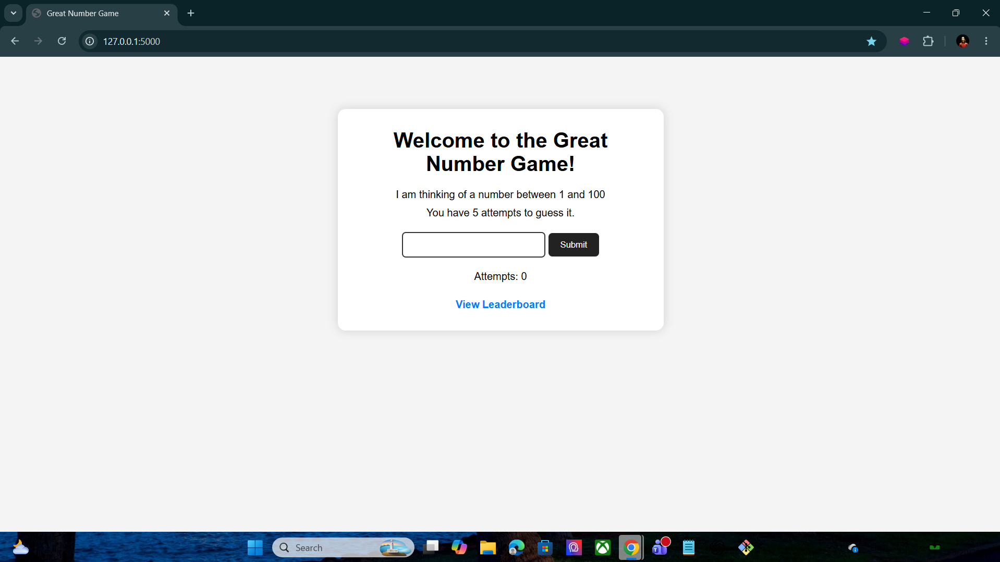
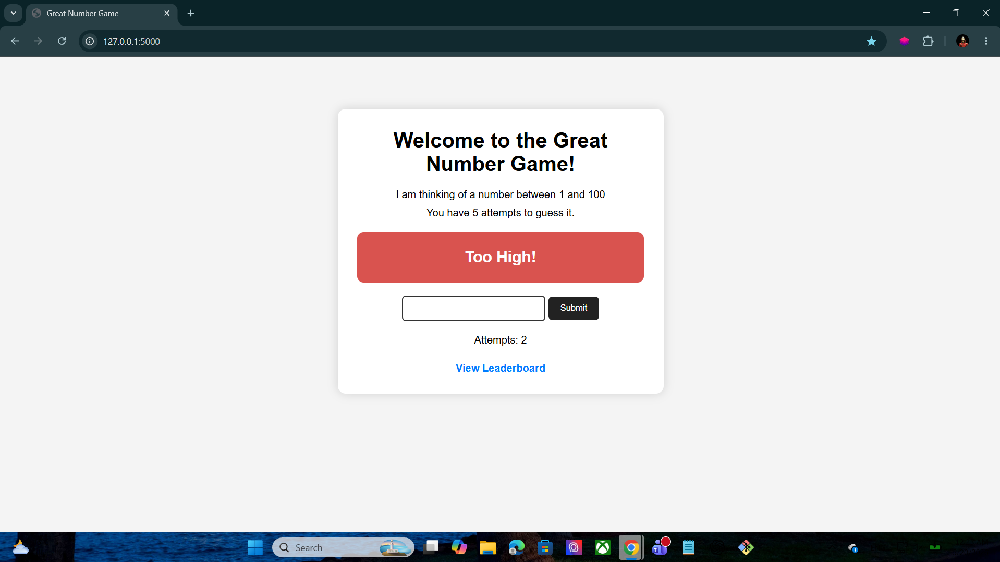
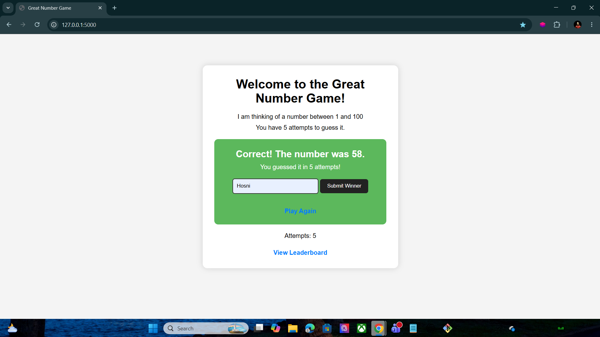
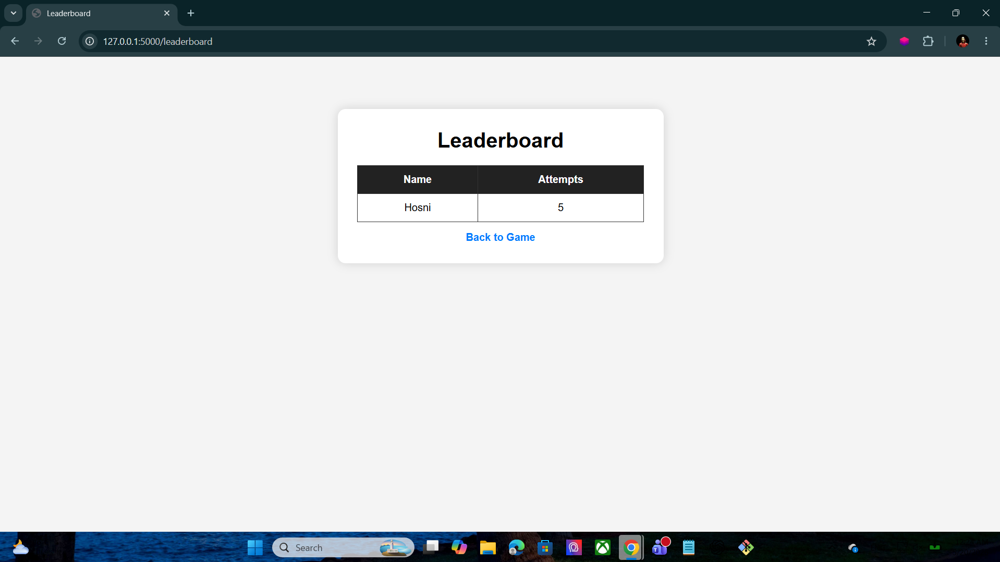

# Great Number Game 🎯

A simple Flask web application where the player tries to guess a random number between 1 and 100 within 5 attempts.

The game provides feedback after each guess and includes a leaderboard system to save winners and their attempts.

---

## Features 🚀

- Random number generation
- Guess validation
- Too High / Too Low messages
- Win and Lose conditions
- Limited attempts system
- Leaderboard page
- Session management using Flask
- Responsive and clean UI

---

## Technologies Used 🛠️

- Python
- Flask
- HTML5
- CSS3
- Jinja2

---

## Project Structure 📂

```bash
great_number_game/
│
├── static/
│   └── style.css
│
├── templates/
│   ├── index.html
│   └── leaderboard.html
│
├── server.py
└── README.md
```

---

## Installation & Setup ⚙️

### 1. Clone the repository

```bash
git clone <repository-link>
```

### 2. Navigate to the project folder

```bash
cd great_number_game
```

### 3. Install Flask

```bash
pip install flask
```

### 4. Run the application

```bash
python server.py
```

### 5. Open in browser

```bash
http://127.0.0.1:5000
```

---

## Main Routes 🌐

| Route | Description |
|------|-------------|
| `/` | Main game page |
| `/guess` | Handles user guesses |
| `/save_winner` | Saves winner to leaderboard |
| `/leaderboard` | Displays leaderboard |
| `/reset` | Resets the game |

---

## Screenshots 📸

### Home Page


---

### Too Low Guess


---

### Too High Guess


---

### Winning Screen


---

### Leaderboard Page


---

## Game Logic 🧠

- The server generates a random number between 1 and 100.
- The player enters a guess.
- The application checks if the guess is:
  - Too High
  - Too Low
  - Correct
- The player has only 5 attempts to guess the correct number.
- If the player wins, they can save their name to the leaderboard.

---

## Example Gameplay 🎮

```text
Guess: 20 → Too Low
Guess: 80 → Too High
Guess: 58 → Correct!
```

---

## Author 👨‍💻

Hosni Ahmad

GitHub: Hosni2005
