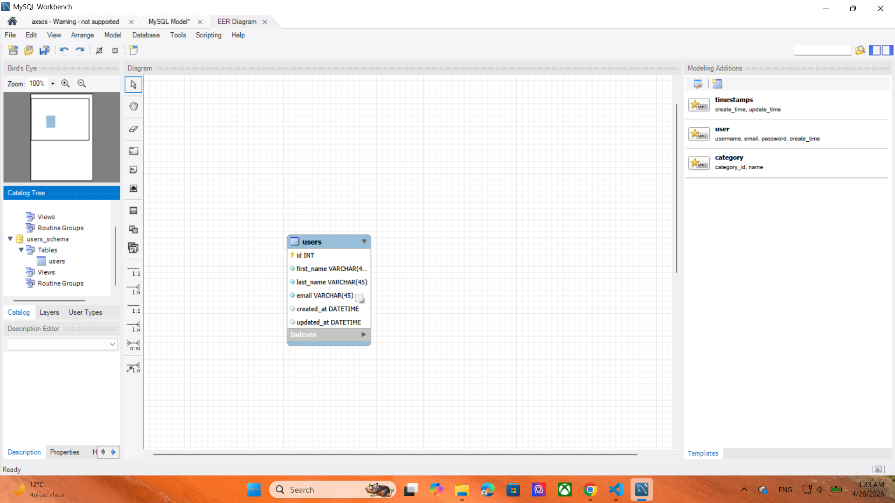

# Users Schema ERD

## Assignment Description
Create an Entity Relationship Diagram (ERD) for an application that tracks users using MySQL Workbench.

## Schema Name
`users_schema`

## Table Name
`users`

## Fields

| Column Name | Data Type | Description |
|------------|----------|-------------|
| id | INT (PK, AI) | Unique user ID |
| first_name | VARCHAR(45) | User first name |
| last_name | VARCHAR(45) | User last name |
| email | VARCHAR(45) | User email address |
| created_at | DATETIME | Record creation date |
| updated_at | DATETIME | Last update date |

## Screenshot

Database schema designed successfully in MySQL Workbench.

## Tools Used
- MySQL Workbench
- ERD Design
- Database Modeling